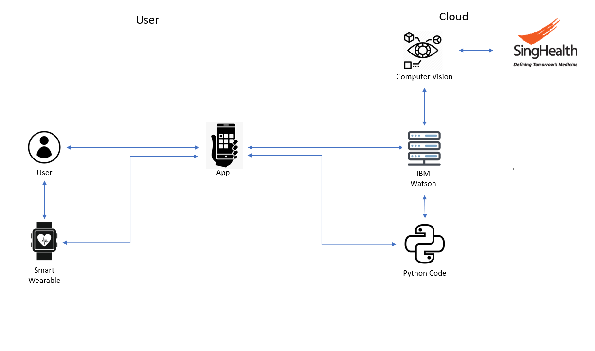

# IT2005-CallforHelp_SCDFXIBM
A group of year 1 poly students trying to gain some experience in the field.
# Call for Help
## Short Description
### What's the problem?

With the increasingly aging population and a growing segment of vulnerable populations in mind, how might we leverage analytics for better sense-making to be alerted at the onset of incidents which require emergency response and mobilise CFRS for effective early intervention especially to the vulnerable population?

### How can technology help?

With the advancement of technology especially in the AI and machine learning fields, we can make use of computer vision and biosensors to detect if someone or somewhere is suffering from an emergency.

### The Idea

We will be making use of IBM Watson to craft an application to reduce response time when it comes to emergency situations by alerting CFRs and professionals. And better prepare reponders with the right resources for the appropriate situation.

## Pitch Proposal

[Pitch Proposal](https://www.youtube.com/watch?v=rXdD7yz7tNM&feature=youtu.be)

## The Architecture

2 Situations it will mainly be used:

1. When the user is alone at home
    1. The User's heart rate will constantly feedback to the Python Code via the App.
    2. Python Code will return whether it is an abnormal value.
    3. If it is abnormal, App shows alert to user.
    4. This repeats until there are consecutive abnormal values.
    5. If there is, then App will prompt a check to see if user is okay, if no response for 1 minute, other user will receives a ping   and dials 995.
    6. other users who respond, will be given instructions based on user medical history.

2. When theres an emergency event and user is CFR.
    1. User will take photo or video of situation via the App.
    2. The data will then be received by IBM Watson and sent to Computer Vision to analyse the data.
    3. If the data is a picture or video of a patient it will get the patient's health conditions from SingHealth which will be sent back to user via App.
    4. If data is a picture of a fire, Watson will analyse it, and understand its severity and the type of fire and the best way to combat it 
    5. Instructions will also be given to user.
    6. If data is a picture or video of a fire the fire will categorized by severity and depending on severity will give instructions to user where possible.

## Long Description
<a href="https://docs.google.com/document/d/1nvfI0ENHBwIohhQT6EjDXGNtcbFp9wNmVMIBolRpPyw/edit" target="_blank">More details is available here</a>

## Getting Started

### IBM Watson

[How it works](fireclassifier/readme.md)

### Python 

[How it works](heartrate/readme.md)
