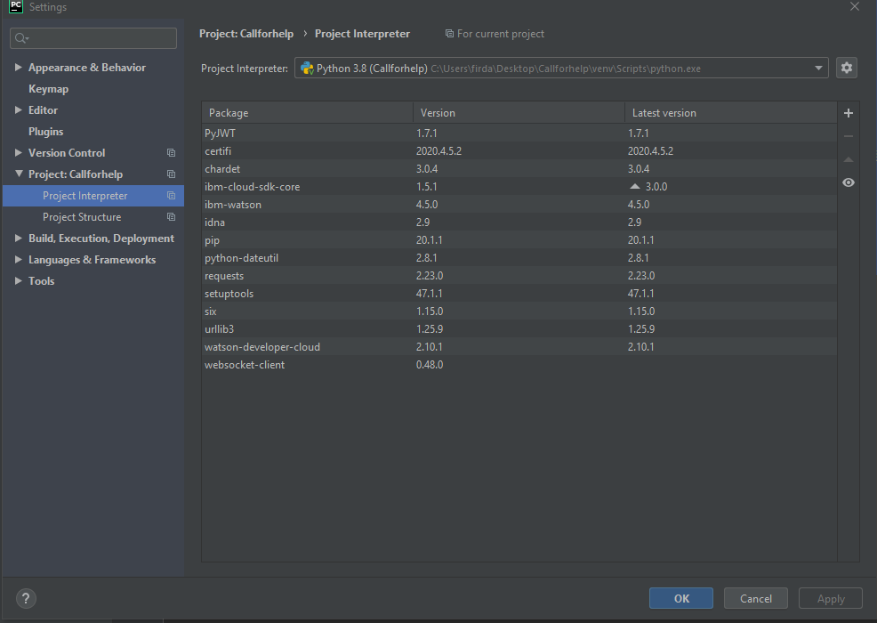
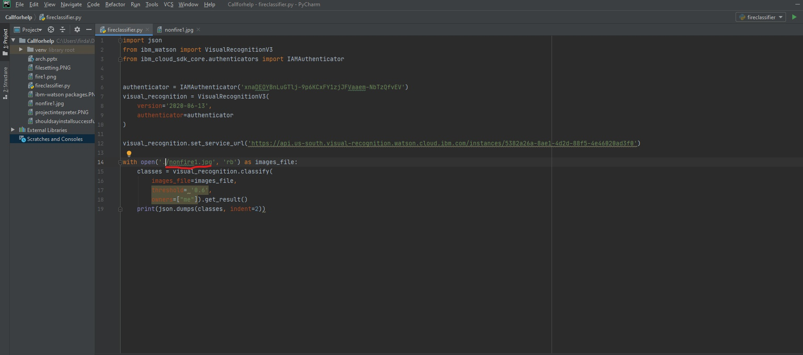

# Before you begin
## setting up python IDE to include IBM-Watson packages/library
-For our environment we will be using PyCharm
-Download all the files in this folder, including the fireclassifier.py

-once done, open project folder, open file settings

-after that, find python interpreter

-next, add a package

-install ibm watson package

-install should be successful

#Running Classification model
### our classification model has been trained from 1000 images dataset of fires and nonfire pictures

-once done, you can go to the fireclassifier.py and change to the image you would like to analyse.

-output for a non-fire image should be classified as nonfire.

-changing to fire image

-output for fire image

